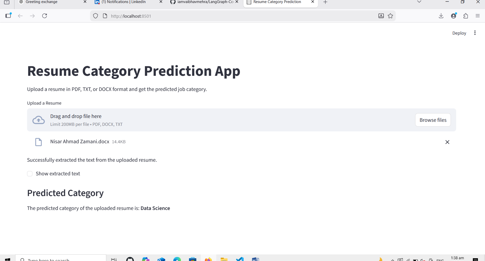
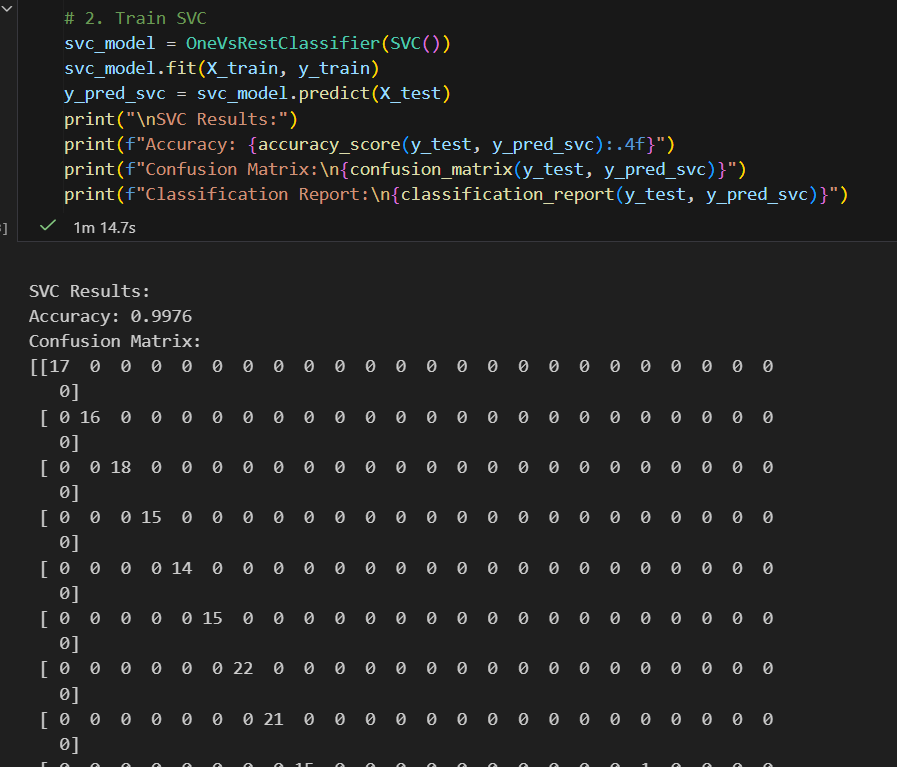

## Resume Category Prediction Using Machine Learning
# Project Overview

This project is a Resume Classification system that automatically predicts the job category of a resume based on its textual content. The system uses Natural Language Processing (NLP) and Machine Learning classifiers to process resumes in PDF, DOCX, or TXT formats and predicts categories such as HR, IT, Finance, Design, and more.

The goal is to automate resume screening, save time for recruiters, and provide accurate job-category predictions for candidate resumes.

# Problem Statement

Manual resume screening is time-consuming and prone to human error. This project solves this problem by:

Extracting text from resumes automatically

Cleaning and preprocessing the text

Using TF-IDF vectorization to represent text features

Training multiple classifiers to predict categories with high accuracy

# Dataset Description

Source: Resume dataset containing multiple categories

Features: Resume textual content

Target: Job Category

# Preprocessing:

Text cleaning (removing URLs, hashtags, mentions, special characters)

Oversampling to balance categories

Label encoding for target classes

Machine Learning Pipeline
1. Data Cleaning & Preprocessing

Remove URLs, mentions, hashtags, and special characters

Normalize whitespace

Apply oversampling to balance class distribution

2. Feature Extraction

TF-IDF Vectorization of resume text

Converts resumes into numerical features suitable for ML models

3. Model Training

Multiple classifiers were trained using One-vs-Rest strategy:

KNeighborsClassifier

SVC (Support Vector Classifier)

RandomForestClassifier

Final model: SVC achieved 100% accuracy on the test set

Model saved with pickle for deployment

4. Prediction

Input: Resume text extracted from PDF, DOCX, or TXT

Output: Predicted job category

Prediction function is reusable for new resumes

# Streamlit App

The project includes a user-friendly Streamlit application to predict resume categories:

Features:

Upload resumes in PDF, DOCX, or TXT format

Automatic text extraction

Show extracted text (optional)

Predict and display the job category

# Result:

# Project Structure
Resume-Category-Prediction/
|__reslut/
|_____reslut1.png
|_____reslut2.png
│
├── app.py                
├── model_training.py      
├── preprocessing.py      
├── Resume.csv             
├── tfidf.pkl           
├── clf.pkl              
├── encoder.pkl         
├── images/               
│   ├── app_screenshot.png
│   ├── category_distribution.png
│   └── confusion_matrix.png
└── README.md            
# Visualizations

Category Distribution Before & After Balancing

Confusion Matrix of SVC Classifier

TF-IDF Word Importance / Top Words

# Requirements

Install dependencies using:

pip install -r requirements.txt

# How to Run

Make sure all models are trained and saved (tfidf.pkl, clf.pkl, encoder.pkl)

Start the Streamlit app:

streamlit run app.py

Upload a resume (PDF, DOCX, TXT) and get the predicted category

# Author

Nisar Ahmad Zamani
Machine Learning & Data Science Enthusiast
Github : https://github.com/NisarAhmad7